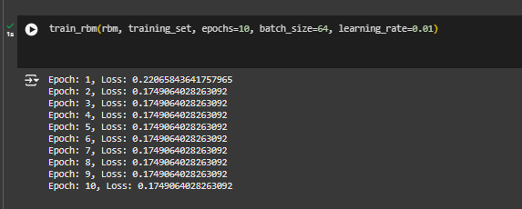

# 🎥 **RecSysCinema: A Movie Recommendation System Using RBM**

Welcome to **RecSysCinema**, a movie recommendation system powered by a **Restricted Boltzmann Machine (RBM)**! This project is built using the **MovieLens dataset** and aims to predict movie preferences for users based on their historical ratings.

---

## 📖 **Overview**
RecSysCinema leverages the power of machine learning to analyze user-movie interactions and generate personalized movie recommendations. By using RBMs, the system learns hidden patterns in the data, enabling it to predict which movies a user might like—even for movies they've never rated before.

---

## 🚀 **Features**
- **Machine Learning with RBM**: Implements a Restricted Boltzmann Machine using PyTorch for efficient collaborative filtering.
- **Customizable**: Easy to adjust the number of hidden units, learning rate, and epochs for training.
- **Performance Tracking**: Evaluates the recommendation system using test loss (Mean Absolute Error).
- **Reproducible Setup**: Well-documented code and data for easy replication.

---

## 📊 Results

- **Test Loss (Mean Absolute Error)**: **0.1589**
- **Sample Recommendations**:
  - **User 1**: "The Shawshank Redemption", "The Godfather", "Pulp Fiction"
  - **User 5**: "The Matrix", "Fight Club", "The Dark Knight"

#### Training Loss Over Epochs:

---

## 🛠️ Customization

You can modify the following parameters in the `rbm_movie_recommender.py` script to fine-tune the model:

- **Number of Hidden Units**: Adjust `n_hidden` to change the feature extraction capability.
- **Learning Rate**: Modify `learning_rate` to control the training speed.
- **Batch Size**: Change `batch_size` to optimize memory usage during training.
- **Number of Epochs**: Increase or decrease `epochs` to control training duration.

---

## 📚 How It Works

1. **Data Preparation**: The MovieLens dataset is preprocessed into user-movie matrices for training and testing.
2. **RBM Architecture**:
   - **Visible Layer**: Represents the movies (input).
   - **Hidden Layer**: Learns latent features (preferences).
   - **Weights**: Connect the visible and hidden layers.
3. **Training**:
   - Implements Contrastive Divergence (CD) to minimize reconstruction loss.
   - Updates weights and biases based on user interactions.
4. **Testing**:
   - Measures the accuracy of recommendations using the Mean Absolute Error (MAE).

---

## 🌟 Future Work

## 🌟 Future Work

- **Implement a Graphical User Interface (GUI):**
  Use a framework like Flask or Streamlit to create a web-based interface where users can select their preferences and see real-time recommendations.

- **Incorporate Implicit Feedback:**
  Extend the model to include additional feedback signals, such as clicks, watch times, or skip actions.

- **Experiment with Larger Datasets:**
  Scale up the model to handle larger datasets like [MovieLens 1M](https://grouplens.org/datasets/movielens/1m/) or Netflix Prize, optimizing for performance and scalability.

- **Integrate Collaborative Filtering:**
  Combine the RBM with collaborative filtering techniques (e.g., matrix factorization) to boost recommendation accuracy.

---

## 📜 License

This project is licensed under the GPL-3.0 license. Feel free to use, modify, and distribute it.

---

## 🤝 Contributions

Contributions are welcome! If you have ideas for improvements or find bugs, please open an issue or submit a pull request.

---

## 📧 Contact

If you have any questions or feedback, feel free to reach out:

- **Email**: stephenthomas382@gmail.com
- **GitHub**: [stevet97](https://github.com/stevet97)

---

## 🎉 Acknowledgments

- **MovieLens Dataset**: Provided by [GroupLens Research](https://grouplens.org/).
- **PyTorch**: For enabling an intuitive and flexible deep learning framework.
